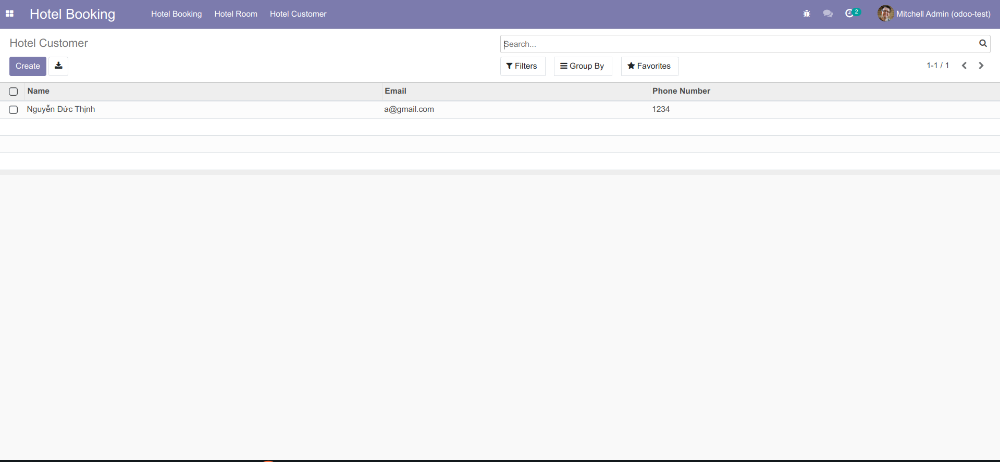
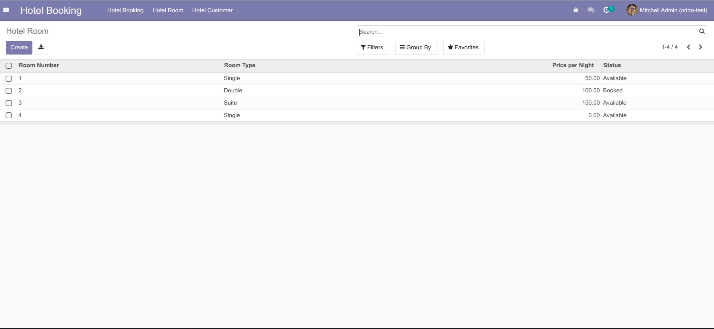
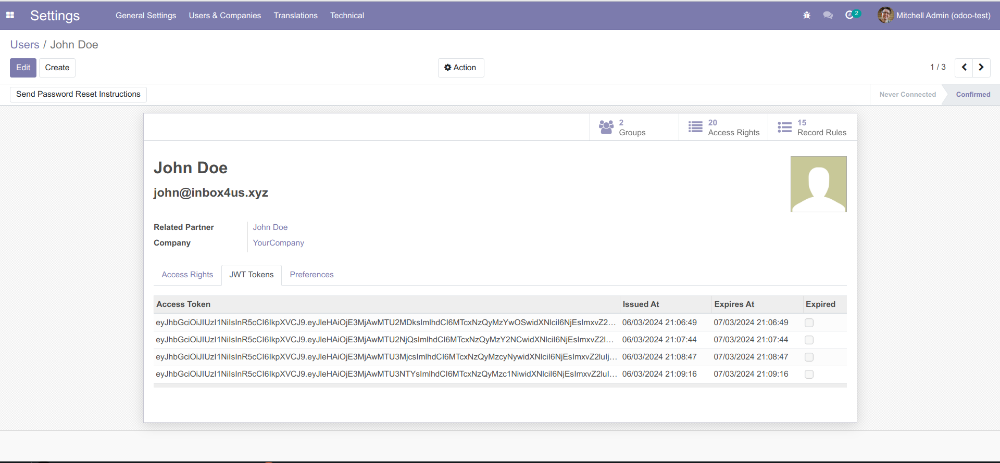

## Inbox4us - Technical Test Requirements for Odoo Hotel Booking Module

Buid a custom Odoo module for managing hotel bookings. This module includes room management, booking management, and customer management. Additionally, implement a REST API for authentication and booking management using JWT.

The module is written on Odoo version 14.

## Table of Contents

- [Prerequisites](#installation)
- [Usage](#usage)
- [API Endpoints](#api-endpoints)
  - [Register](#register)
  - [Login](#login)
  - [Booking](#booking)
- [Testing the API](#testing-the-api)

## Prerequisites

This module require pyjwt and simplejson:

```bash
pip3 install pyjwt==2.8.0
pip3 install simplejson==3.19.2

```

Check full version libary in file:

```
requirements.txt
```

## Usage

**Module Interface:**






**Manage Token User:**

The tokens, once generated, will be stored and managed here. Expired tokens will not be authenticated.



**Define SECRET_KEY:**

SECRET_KEY is a secret string used for encoding and decoding tokens.


## API Endpoints

### Register

```
/api/auth/register
```

Based on the SECRET_KEY to encode data and generate tokens.

It will return the Token, user data, and status upon success.

If successful, it will create a **user portal** on the Odoo server.

### Login

```
/api/auth/login
```

Based on the SECRET_KEY to encode data and generate tokens.

Login authentication is based on the provided email and password. If authentication is successful, it will return the Token, user data, and status.

### Booking

```
/api/bookings
```

User authentication is based on the provided token. If the token is valid, it will proceed to create a hotel booking and return the hotel booking data and status

## Testing API

1. **Clone the repository:**
1. **Clone the repository:**
1. **Clone the repository:**
1. **Clone the repository:**
